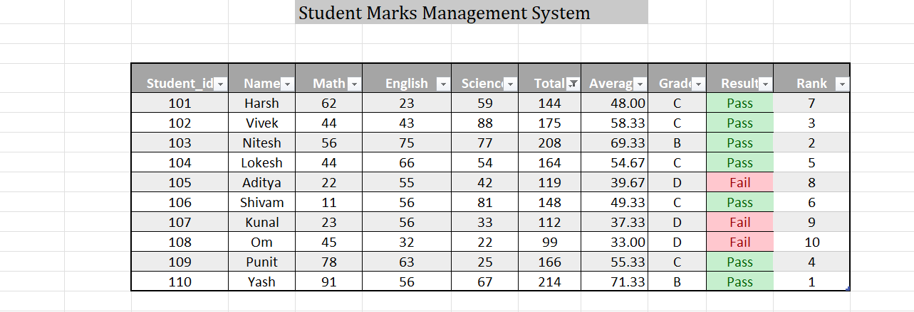

# excel-student-marks-management
# Student Marks Management System (Excel Project)

This is a beginner Excel project that demonstrates how to analyze student marks using Excel formulas and data visualization.

## Features
- Automatic total marks calculation
- Average marks calculation
- Grade assignment using IF function
- Pass/Fail evaluation
- Student ranking system
- Data visualization using charts

## Excel Concepts Used
- SUM
- AVERAGE
- IF Function
- RANK Function
- Conditional Formatting
- Charts

## Project Preview

## Tools Used
Microsoft Excel

## Author
-- Atharva Santosh Katkar
Harsh

